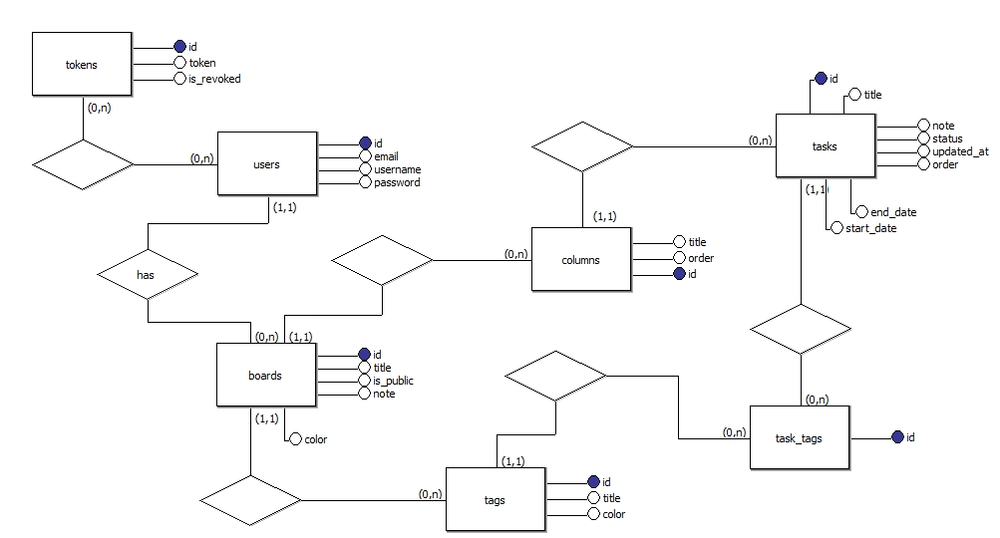

# Programação Orientada a Objetos da Web I - Trabalho ProManager
Trabalho desenvolvido durante a disciplina de Programação Orientada a Objetos da Web I
Implementação de sistema de gerenciamento de tarefas (quadro kanban): CRUD de usuários, quadros, colunas, cards e etiquetas. Atualmente, 
foco no backend (java), portanto, ainda não há drag and drop dos itens dentro do quadro nem estilização. 

> Utilizando-se o [IntelliJ IDEA](https://www.jetbrains.com/pt-br/idea/) para implementação e o [Maven](https://mvnrepository.com/) 
> para lidar com versões das ferramentas, bibliotecas e frameworks.

## :zap: Etapas da elaboração :zap: 
### 🔸 1ª etapa - Inicialização do projeto 🔸
1. Inicialização do projeto maven na IDE 
 - Novo > projeto > maven
 - Marcar opção "create from archetype" 
 - Selecionar maven-archetype-webapp
 - Esolher nome dos artefatos e projeto e local do projeto
2. Download do servlet WildFly
3. Descompactação do arquivo baixado
4. Edição das configurações do projeto adicionando o JBoss local com o path (caminho) do arquivo descompactado
5. Correção de bugs caso existam (utilizando as recomendações da IDE)
6. Aplicação das configurações
7. Inicialização do servidor
<hr />

### 🔸 2ª etapa - Construção do MVC + DAO + Service (Model, View, Controller e DAO) 🔸
1. Em src > main > java, realizar a criação de um pacote identificador do projeto (ex: br.rarantes.si.poowi)
2. No pacote criado, adicionar os pacotes: Model, Controller, DAO e Service

> O pacote model irá abrigar o modelo das tabelas do banco relacional a serem utilizadas pela aplicação; 
> 
> Controller será a camada intermediária entre a View (camada de visualização, parte visual da aplicação) e 
> 
>  A camada DAO (responsável pela comunicação com o banco de dados. 
>  
>  Service será o pacote de armazenamento dos serviços da aplicação, 
> como, por exemplo, a verificação se um usuário está autenticado e tem permissão para acessar a informação solicitada.

3. Em model, criar os modelos de usuário com os campos necessários (nome, email, senha, status de atividade), quadros (título, 
visibilidade, comentários), colunas (título, ordem, quadro), cartões (título, status, comentários, data início, data fim, ordem, data alteração, coluna),
etiquetas (título, cor, quadro), etiqueta-cartao (cartão, etiqueta).
4. Em webapp > WEB-INF > home, adicione o arquivo login.jsp e escreva uma página de login por meio de HTML e CSS (opcional).
> Adicione as seguintes notações ao topo do arquivo; 
```
<%@ taglib prefix="c" uri="http://java.sun.com/jsp/jstl/core" %> <!-- garantir que a página receba as informações necessárias para a taglib. O prefixo pode ser alterado de acordo com sua preferência. -->
<%@ page contentType="text/html;charset=UTF-8" language="java" %> <!-- padrão -->
<%@page isELIgnored="false" %> <!-- garantir que a página receba as informações necessárias e seja redirecionada corretamente -->
```
5. Ainda em login, adicione a taglib dentro do html para poder exibir uma mensagem de erro que será recebida pelo controller.
> Exemplo: 
```
<c:if test="${not empty error}"> <!-- error será o atributo que iremos criar no controller para retornar o erro, enquanto que o not empty estará testando se o atributo estará vazio -->
    <div class="container center">
        <h2 class="child error"> <!-- error, neste caso, se refere à classe css e não ao atributo java -->
            <b>${error}</b>
        </h2>
    </div>
</c:if>
 ```
6. Busque no repositório maven (MVN Repository) pelo webservlet e adicione a dependência ao seu arquivo pom.xml;
7. Agora em controller, crie o controller index com a notação @WebServlet e informe a rota padrão ("/");
8. Na classe IndexController que estenderá HttpServlet, sobrescreva o método doGet e redirecione a rota para a página de login utilizando o RequestDispatcher
```
RequestDispatcher rd = request.getRequestDispatcher(uri); // onde request é o parâmetro recebido pelo método doGet e uri será a uri de redirecionamento (EX: "/WEB-INF/home/dashboard.jsp")
rd.forward(request, response); // forward realiza, de fato, o redirecionamento. Response também é um parâmetro recebido pelo método.
```
8. Feito o controller index, para redirecionar o projeto ao iniciar para a página de login, vamos realizar o login de fato. Para tanto, crie o 
controller de login;
9. No LoginController, sobrescreva o método doPost nele será verificado se o usuário X existe ou não. 
10. Para tanto, você precisará criar um serviço para verificar se aquele usuário está autenticado ou não. Logo, crie o o UsuarioService
11. Nele, será chamada a classe DAO de usuário para a busca de suas credenciais e, caso estejam corretas, retornará o usuário para o método doGet do 
LoginController;
12. Para isso, você precisará adicionar informações de usuário na classe DAO. Inicialmente, você pode criar um usuário manualmente para testar e, 
posteriormente adicionar a busca ao banco de dados.
> Assim, crie o método getUsuario na classe UsuarioDAO para buscar usuarios na sua base, que receba por parâmetro o email informado pelo jsp. 
> Nesse método, adicione um usuário para testar e, caso o email 
> recebido por parâmetro corresponda a algum em sua base, retorne o usuário. Do contrário, retorne null.
```
  Usuario user = new Usuario();
  user.setEmail("email@mail.com");
  user.sestSenha("12356");
```
13. Assim, no service UsuarioService, chame no método de autenticação (nesse caso, chamado de autenticado(String email, String senha)) o método 
getUsuario da classe DAO;
14. Se a senha e o email corresponderem, retorne o usuário encontrado para o controller LoginController.
15. Agora com as informações recebidas, no controller de login, você pode retornar, caso o usuário foi encontrado, os dados do usuário e chamar uma 
página privada (neste caso, dashboard.jsp) ou uma mensagem de erro
> A mensagem de erro poderá ser enviada por meio de um atributo, como comentado anteriormente. Isso poderá ser feito da seguinte maneira: 
`` request.setAttribute("error", "Usuário e/ou senha incorretos!"); ``
> (passando o nome do atributo seguido da mensagem de erro).

> Use ``HttpSession session = request.getSession();`` para adicionar a sessão ao login do usuário. Use ``request.getSession().invalidate();`` para encerrar 
a sessão. 
> Assim, você bloqueará que usuários sem acesso possam acessar páginas privadas ao retornar à url privada sem login.
<hr/>

## :zap: O projeto :zap:
### Descrição do projeto
1 - INTRODUÇÃO

O projeto visa utilizar na prática os conhecimentos adquiridos ao longo do curso até o
momento com enfoque nos conhecimentos obtidos na disciplina de Programação Orientada
a Objetos da Web I do curso de Sistemas para Internet. Além disso, o projeto visa auxiliar a
gerenciar as atividades do dia a dia, através de um quadro interativo que segue o modelo
Kanban. Esse modelo permitirá adicionar quadros/murais interativos e tarefas dentro dos
mesmos, definindo lembretes, estado de conclusão entre outras informações . Assim, o
usuário poderá gerenciar suas tarefas dinamicamente por meio de software, sem precisar
depender de um planner físico para tal.

Atualmente já existem alternativas desse modelo de sistema, que utiliza a metodologia
Kanban. Assim sendo, a proposta deste trabalho vem como uma alternativa para os
softwares existentes, que poderá ser disponibilizada gratuitamente e usada como auxílio ao
estudo de outros estudantes da área da informática, bem como uma forma de colocar em
prática os conhecimentos obtidos em um sistema de já sucesso.

2 - ESTRUTURA DO PROJETO

A estrutura planejada para o projeto visa englobar
- Usuários individuais do sistema, por meio de cadastro e login, armazenando
as seguintes informações, email, nome de usuário e senha/
- Usuários individuais podem cadastrar quadros /murais. Cada quadro terá um
nome e poderá ter também uma descrição e a opção de ser público ou não.

Se o quadro for público, deve ser gerada uma url pública para edição e
visualização do quadro. Do contrário, somente o usuário proprietário do
quadro terá permissão para acessar e editar.
- Em cada quadro, o usuário poderá cadastrar colunas, seguindo o modelo
Kanban. Cada coluna possui um título ou nome e a ordem de exibição da
mesma dentro do quadro, que será gerada automaticamente e poderá ser
editada.
- Em cada coluna, por sua vez, o usuário poderá cadastrar tarefas/cards de
tarefas que terão obrigatoriamente um título, status (pendente, em
andamento ou concluído), ordem de exibição (que seguirá a mesma lógica
usada nas colunas) e poderá ter também data de início e término e a data da
última alteração realizada.
- Também em cada quadro, deve ser possível adicionar tags/etiquetas que
poderão ser vinculadas às tarefas. Cada tag precisará conter um título e uma
cor, podendo ser definida uma cor padrão de acordo com o layout utilizado na
aplicação.

### Modelo Relacional (Diagrama Entidade - Relacionamento/ER)
A partir dos requisitos definidos anteriormente, foram gerados os diagramas relacional e lógico, conforme pode ser visto abaixo


